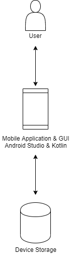
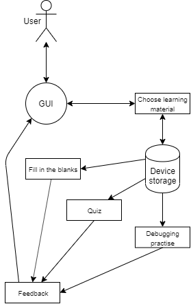
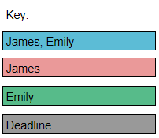
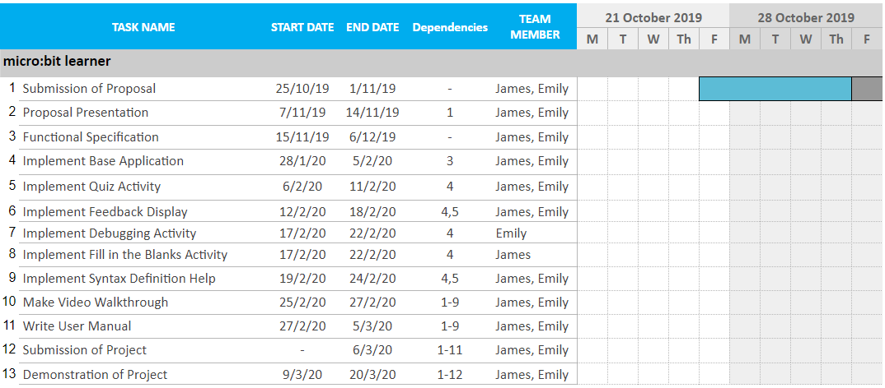
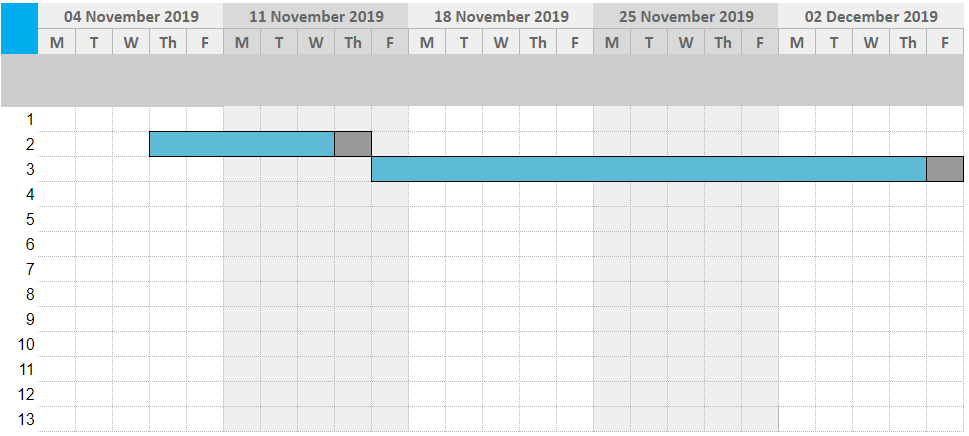
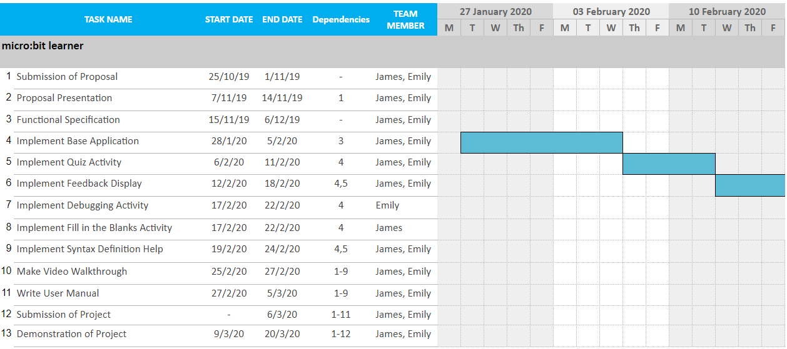
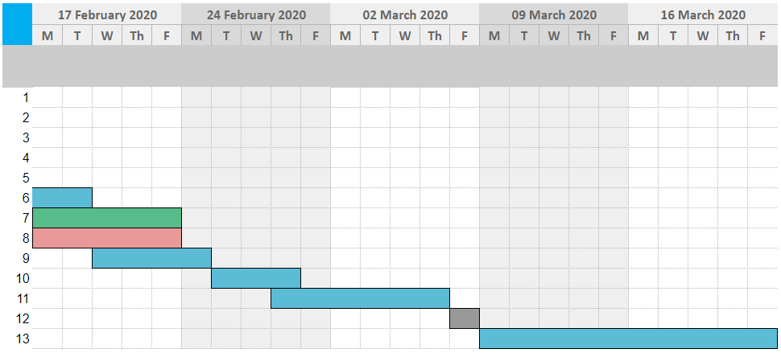

	<h1>CA326</h1> 
	<h1>James Farrelly</h1>
	<h1>Emily Whyte</h1> 
	<h1>micro:bit learner</h1> 
	<h1>Functional specification</h1>   
	<h1><u>Table of contents</u></h1>

<h2><u>1. Introduction</u></h2>
&nbsp;&nbsp;&nbsp;&nbsp;<b>1.1</b> Overview............................. 
&nbsp;&nbsp;&nbsp;&nbsp;<b>1.2</b> Glossary............................. 
<h2><u>2. General description</u></h2>
&nbsp;&nbsp;&nbsp;&nbsp;<b>2.1</b> Product/System functions............................. 
&nbsp;&nbsp;&nbsp;&nbsp;&nbsp;&nbsp;&nbsp;&nbsp;<b>2.1.1</b> Choose learning material............................. 
&nbsp;&nbsp;&nbsp;&nbsp;&nbsp;&nbsp;&nbsp;&nbsp;<b>2.1.2</b> Quizzes............................. 
&nbsp;&nbsp;&nbsp;&nbsp;&nbsp;&nbsp;&nbsp;&nbsp;<b>2.1.3</b> Fill in the blanks............................. 
&nbsp;&nbsp;&nbsp;&nbsp;&nbsp;&nbsp;&nbsp;&nbsp;<b>2.1.4</b> Debugging practice............................. 
&nbsp;&nbsp;&nbsp;&nbsp;&nbsp;&nbsp;&nbsp;&nbsp;<b>2.1.5</b> Activity feedback............................. 
&nbsp;&nbsp;&nbsp;&nbsp;&nbsp;&nbsp;&nbsp;&nbsp;<b>2.1.6</b> Syntax definitions............................. 
&nbsp;&nbsp;&nbsp;&nbsp;<b>2.2</b> User characteristics and objectives............................. 
&nbsp;&nbsp;&nbsp;&nbsp;<b>2.3</b> Operational scenarios............................. 
&nbsp;&nbsp;&nbsp;&nbsp;<b>2.4</b> Constraints............................. 
<h2><u>3. Functional requirements</u></h2>
&nbsp;&nbsp;&nbsp;&nbsp;<b>3.1</b> Choose learning materials............................. 
&nbsp;&nbsp;&nbsp;&nbsp;<b>3.2</b> Quizzes............................. 
&nbsp;&nbsp;&nbsp;&nbsp;<b>3.3</b> Activity feedback............................. 
&nbsp;&nbsp;&nbsp;&nbsp;<b>3.4</b> Debugging practice............................. 
&nbsp;&nbsp;&nbsp;&nbsp;<b>3.5</b> Fill in the blanks............................. 
&nbsp;&nbsp;&nbsp;&nbsp;<b>3.6</b> Syntax definitions............................. 
<h2><u>4. System architecture</u></h2>
&nbsp;&nbsp;&nbsp;&nbsp;<b>4.1</b> Diagram............................. 
&nbsp;&nbsp;&nbsp;&nbsp;<b>4.2</b> Description............................. 
<h2><u>5. High-level design</u></h2>
&nbsp;&nbsp;&nbsp;&nbsp;<b>5.1</b> Diagram............................. 
&nbsp;&nbsp;&nbsp;&nbsp;<b>5.2</b> Description............................. 
<h2><u>6. Preliminary schedule</u></h2>
&nbsp;&nbsp;&nbsp;&nbsp;<b>6.1</b> Diagrams............................. 
   

	<h1><u>1. Introduction</u></h1>

<h2><u><b>1.1</b> Overview</u></h2>
The product to be developed is called micro:bit learner. It will be a mobile application that teaches people to use programming languages that are often used to program on a BBC micro:bit (in JavaScript and MicroPython). The app will use activities such as filling in the blanks, finding errors in code and multiple choice questions to help people develop their learning of the programming languages and fundamentals. 
The material of the activities will be based on the lessons and content available for people using micro:bits to develop their abilities. The application will be useful for people seeking to learn the “theoretical” side of micro:bit programming in a consistent, gradual way. 
Debugging will also be focused on in the activities through asking users to identify the issue with a piece of code or teaching them the simplified english translation of the various error codes encountered when programming, particularly for beginners. 
Feedback is an important feature of this application. When a user answers a question incorrectly, they will receive an explanation as to why their answer was not right. At the end of each activity, users will also receive an analysis of their results. It may identify which areas they may need to improve on or acknowledge when they have answered perfectly. 
The application will be running on android mobile phones. 
<h2><u><b>1.2</b> Glossary</u></h2>

Term | Definition
--- | ---
BBC micro:bit | A handheld micro-computer which is programmable and has many features; from buttons and an accelerometer to 25 LEDs.
Java | A general purpose, class-based and object-oriented programming language.
MicroPython | An implementation of Python 3 that is optimised for use on microcontrollers and constrained environments.
Kotlin | An open source, general purpose and statically typed programming language with type interface.
Android Studio | The official integrated development environment used for Google’s Android operating system.
GUI | A graphical user interface that allows a user to interact with an electronic device with the use of graphics and audio.
Boolean | A data type that has only two values True (1) or False (0).

  

	<h1><u>2. General description</u></h1>

<h2><u><b>2.1</b> Product/system functions</u></h2>
<h3><u><b>2.1.1</b> Choose learning material</u></h3>
Upon entering the app, users will be given a choice between the available programming languages they wish to practice and learn through various activities. Users will also have the opportunity to view a brief explanation of the differences between their language options before choosing. Once users have selected their language choice, they will be presented with a list of the various topics, associated with micro:bit programming, that can be covered. Users select a topic and are then taken to an activity based on the chosen topic. When the user first does an activity, they will be shown a tutorial on how to answer their questions.
<h3><u><b>2.1.2</b> Quizzes</u></h3>
Users can be questioned on topics through quiz questions. These will ask various questions relating to the topic they chose before starting the activity. Some questions may have only one correct answer that the user must choose, while some have multiple answers. Questions with multiple answers allow users to select and deselect their choices before submitting their final answer.
<h3><u><b>2.1.3</b> Fill in the blanks</u></h3>
Users can test their knowledge of coding through the use of fill in the blank questions. For example, the user could be given a choice of four logical operators to place in a line of code to make it evaluate to a boolean value. This encourages users to mentally evaluate programming equations.
<h3><u><b>2.1.4</b> Debugging practice</u></h3>
As debugging is a vital part of all programming and an important skill to have at any level, there will be debugging activities in the app. Users will be asked to re-type certain lines of code snippets in order to correct bugs or to identify which line has a bug. There will also be an activity which asks users to match error codes with their simple English translation. This will help users to understand the errors they may encounter when writing their own code for various projects.
<h3><u><b>2.1.5</b> Activity feedback</u></h3>
As users complete activities, they will be told whether the answer they have chosen is right or wrong. If their answer was wrong, they will be given an explanation for the correct answer. At the end of each activity, they will also have the choice to review the explanations and questions for each of their incorrect answers, if they have any. In addition to this, when the user has completed an activity, they will be shown a breakdown of their results. It may highlight which areas they need to improve on or they appear to excel in.
<h3><u><b>2.1.6</b> Syntax definitions</u></h3>
Users may come across syntax that they are unfamiliar with when carrying out their activities, leaving them stuck. The activities may highlight such words and allow users to press them and receive a definition or explanation. This will enable users to develop a greater understanding of the terms used in programming.
<h2><u><b>2.2</b> User characteristics and objectives</u></h2>
The only user for our app is the student. The user is there to complete quizzes. On first opening the app the user will be given a brief tutorial on how to use it. The user will then select the language they wish to learn. After this they will be presented with available quizzes. Quizzes will differ depending on what the user is learning. This quizzes include fill in the blank questions, matching code output and debugging problems. Once the user chooses a quiz they will be able to progress through it at their own pace apart from a few timed challenges. If the user doesn’t understand a certain highlighted or underlined word they may click it and get a simple description of what it means. If a user gets a question wrong they will receive an explanation as to why in simple english and then once a quiz is finished they will get a report giving them feedback on the types of questions they could improve upon as well as encouragement for doing well in certain topics. 
As the users will be beginners to programming quizzes we will start very basically and slowly increase in difficulty, but ultimately get into more complicated problems. A main focus of our app is to keep it simple, in both language and interface. Our target audience isn't extremely computer literate so there’ll be a huge focus on supportive and patient language while the interface will be similar to apps like duolingo, keeping it minimalistic and clear with very little menus and just being focused on quizzes and learning but also familiar. The user won't have to create an account which could please parents who want their children to have as little a footprint as possible on the internet while still wanting them to learn how to code. Throughout the app there will be helpful buttons such as when deciding what language to learn there’ll be clickable link that tells you about MicroPython and Java.
<h2><u><b>2.3</b> Operational scenarios</u></h2>
<h3><u><b>2.3.1</b> Language selection</u></h3>
The user upon opening the app will have to decide between learning either MicroPython or Java. The user will also receive a description of each language as described in the user characteristic and objectives section if they require. Upon clicking on a language the user will be directed to the quiz menu for that language.
<h3><u><b>2.3.2</b> Quizzes</u></h3>
Upon selecting a quiz the user will be given a question which could be one of the 3 types, filling in the blanks, matching code output and type questions. For the fill in the blank questions the user will select one or more options available and place them in the correct order. As for matching code output questions the user will have to type in the expected output of the program and finally for the type questions the user will select one an answer to submit. If the user gets the question right they will be notified and let continue to the next question. Otherwise the user will be informed they’ve made a mistake and it’ll be explained to them as to why.
<h3><u><b>2.3.3</b> Debugging practice</u></h3>
For some exercises users will be tasked with finding the error in a piece of code. The user will have to select the line  the error appears on and like the quizzes will be given feedback after each quiz.
<h3><u><b>2.3.4</b> Activity feedback</u></h3>
After the user completes a quiz they will be presented with feedback screen where they will receive a report on their attempt of the quiz. Users will be notified of areas they can improve upon and given helpful tips and information. The user will also receive encouragement for the questions they get right. We wish to add a scoring system to the app but are unsure if we will be able to complete it by the deadline but if added it would tally up each question and add the score from the quiz to the users total.
<h3><u><b>2.3.5</b> Syntax definitions</u></h3>
Throughout the app the user will be able to click on underlined syntax which they wouldn’t be familiar with. Upon pressing the word a pop-up will appear explaining the meaning of that certain piece of syntax in simple english and uses for it. The user will then be able to close the popup picking up exactly where they left off.
<h3><u><b>2.3.6</b> Choosing activity</u></h3>
The user, once a language is chosen, will pick a quiz from the quiz menu. The user can only open quizzes they have unlocked after completing previous quizzes. The individual quiz icon when clicked by the user will have a small pop-up confirming the start of the quiz. The quiz will then start once the user accepts the pop-up.
<h3><u><b>2.3.7</b> First time using app</u></h3>
Upon first opening the app the user will be greeted with a small tutorial as they view a page for the first time. Upon first opening the app the user will be greeted with a small tutorial as they view a page for the first time. The app will highlight important information and give tips on how to use the app itself. The user will click continue to progress through the tutorial at their own pace.
<h2><u><b>2.4</b> Constraints</u></h2>
<b><u>Storage requirements</u></b> 
Our application, quizzes and progress will all be stored in memory as we want the app to be usable offline. As our app grows to accompany new features and languages we will have to keep the amount of storage used to a minimum. We are conscious of the amount of storage people have on their phones and therefore must find the most optimal way to store it. 
<b><u>Time constraints</u></b> 
We hope to be continually be adding new features and quizzes throughout the development of the app. However, after learning Android Studio, Kotlin and building our app, we have a strict deadline to submit the project to our CA326 module coordinators for grading before Friday March 6 2020. This will limit our development. 
<b><u>User requirements</u></b> 
Due to our app being marketed towards those less computer literate there will be serious constraints on how complicated our app can be. 
<b><u>Android platform</u></b> 
As our development will be done using Android Studio, we will be limited to creating an app for use on Android mobiles. Android mobile phones are also most readily available to use for personally testing our app during development. This means Apple phone users will not have any access to the app. 
<b><u>Hardware</u></b> 
We want our app to be usable on most Android phones, but they come in a wide range of shapes and sizes. We will try to make the app adaptable to most Android phone models but this will be limited by our strict deadline. We will prioritise making the app scalable to the most recent models.    

	<h1><u>3. Functional Requirements</u></h1> 

<h2><u><b>3.1</b> Choose learning material</u></h2>
<b><u>Description</b></u>  
When the user first opens the app, they will be given the choice between the available languages for micro:bit programming that they can learn. They are then offered a choice between the various activities based on the chosen language. 
<b><u>Criticality</b></u> 
This function is required if users are to have the power to decide on the topics they learn and at which pace. Without this function, users will only be able to go through the activities in a linear way. They may have to do activities for a different language before getting to the one they wanted to use the app for.  
<b><u>Technical issues</b></u> 
The language choices will be shown in a simple way, consistent to the interface throughout the app. An explanation of the different languages will also be provided to the user to help them decide. Once they have selected a language, the app will load a list (in the form of a menu) of the different topics they can learn through activities. The questions for the activities will be loaded from the mobile device’s storage. 
<b><u>Dependencies with other requirements</b></u>  
This function is independent of other functions as it is the first to be carried out. 
<h2><u><b>3.2</b> Quizzes</u></h2>
<b><u>Description</b></u> 
Questions are written about the material covering the listed topics on micro:bit programming. When a question has only one correct answer, the user will click their chosen answer. For questions with multiple correct answers, users can click to select and deselect their answers until they click to submit them. When a user begins their first quiz, they will go through a short tutorial to explain how they can answer the various questions.  
<b><u>Criticality</b></u>  
This function is important as it is the most simple of the available activities. It must be perfected before the implementation of the other activities. 
<b><u>Technical issues</b></u> 
The interface of the questions and answers must be easily understood. Users need to find it easy to choose their answers so they can focus on the actual question. The answers must also be stored correctly in order to give the correct feedback and results to the users. The tutorial needs to be clear in order for users to understand how to complete activities. 
<b><u>Dependencies with other requirements</b></u> 
This function depends on the chosen learning material function to load the correct questions for the activity. 
<h2><u><b>3.3</b> Activity feedback</u></h2>
<b><u>Description</b></u> 
Users receive feedback while they are doing activities as well as when they have completed an activity. When the user chooses the correct answer, they will be shown a message saying they chose correctly. When the user chooses an incorrect answer, they will be shown the correct answer and an explanation of why it is correct. At the end of an activity, there will be a breakdown of the results. This will show the user which areas they may need to improve on and which areas they are doing well in. They will also have the option to view the explanation for questions they answered incorrectly.   
<b><u>Criticality</b></u> 
Feedback is vital for the app to be beneficial to users in their learning.  
<b><u>Technical issues</b></u> 
Feedback needs to be clear for users to understand and learn from their incorrect answers. 
<b><u>Dependencies with other requirements</b></u>   
This function depends on the activity functions in order to receive the results of each one in order to display them for the user. This function is never used if the user does no activities.  
<h2><u><b>3.4</b> Debugging practice</u></h2>
<b><u>Description</b></u> 
As an activity, users are asked to practice their debugging skills. This is done in two ways. The first is through showing code snippets that contain a given error code which the user must correct by identifying and re-typing the incorrect line. The second way is to choose the correct error code to match a simple english translation of it. This is to build an understanding of the errors users will encounter when doing their own programming.  
<b><u>Criticality</b></u> 
This function is important because we stress the importance of practicing debugging as a beginner in programming and throughout all programming experience. 
<b><u>Technical issues</b></u> 
Code snippets must not become too long as the font will decrease in size to fit each line on the screen and possibly make the question unreadable. For the typing question, it is important to process the user’s input correctly in order to accept any version of the correct answer. This means processing capital letters and different spacing correctly in order to avoid marking an answer as wrong just because it doesn’t match one exact answer. 
<b><u>Dependencies with other requirements</b></u> 
This function depends on the chosen learning material function to receive the language that has been chosen by the user. The language chosen will affect the error codes that are used in the questions. 
<h2><u><b>3.5</b> Fill in the blanks</u></h2>
<b><u>Description</b></u> 
Another activity requires users to select the correct value/operator to place in a blank space that is part of a line of code. The code may either need to be fixed (correct the syntax) or evaluate to a specified boolean value. 
<b><u>Criticality</b></u>  
This activity is important for having a variety of activities available on the app. However, it is not required for the rest of the app to function as intended. 
<b><u>Technical issues</b></u> 
The interface of the question must be clear in order for the user to understand which part of the line has been left blank. The app must also correctly take the user’s answer to check the result. 
<b><u>Dependencies with other requirements</b></u> 
This function also relies on the choose learning material function to receive the questions and code snippets that have been loaded. 
<h2><u><b>3.6</b> Syntax definitions</u></h2>
<b><u>Description</b></u>  
Users will have the option to click on certain highlighted words to view a definition or explanation of them. This will help them in answering their questions without getting stuck on common terms. 
<b><u>Criticality</b></u> 
This function is a desirable feature to improve the app. However, it is not required for the app to function. 
<b><u>Technical issues</b></u>  
It must be clear to the user when a word is highlighted to show that a definition is available. Definitions must be correct for the specific words.  
<b><u>Dependencies with other requirements</b></u> 
This function depends on the activities to receive the words used in each question in order to check which may need to be highlighted and defined.    

  

	<h1><u>4. System architecture</u></h1>

<h2><u><b>4.1</b> Diagram</u></h2>

 

	

<h2><u><b>4.2</b> Description</u></h2>
<b><u>User</b></u> 
The user is the actor in our System architecture diagram. The user interacts with the application as described in 2.3.  
<b><u>Mobile application & GUI</b></u> 
The mobile application & GUI is both the front and backend of the app. It interacts with both the user and the Device Storage. Our kotlin programs will control how the quizzes are displayed by getting quiz data from device storage. It will then format it into working quizzes. The applications graphical user interface will be controlled by android studio and interacted with by the user.  
<b><u>Device storage</b></u> 
The device storage stores everything associated with the app. It will hold all the images for it as well as the files that will hold the information for the quizzes which will be sent to the Mobile Application & GUI.  

  

	<h1><u>5. High-level design</u></h1>

<h2><u><b>5.1</b> Diagram</u></h2> 

	

<h2><u><b>5.2</b> Description</u></h2>
The device storage stores everything associated with the app. It will hold all the images for it as well as the files that will hold the information for the quizzes which will be sent to the Mobile Application & GUI.  

  

	<h1><u>6. Preliminary schedule</u></h1>

<h2><u><b>6.1</b> Diagrams</u></h2></b>

  

   

  

   

  

   

  

   

  

   

  

