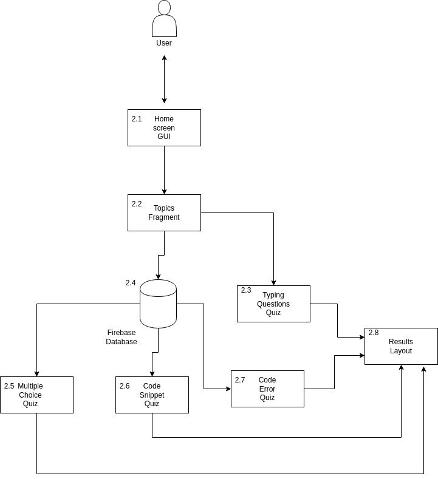
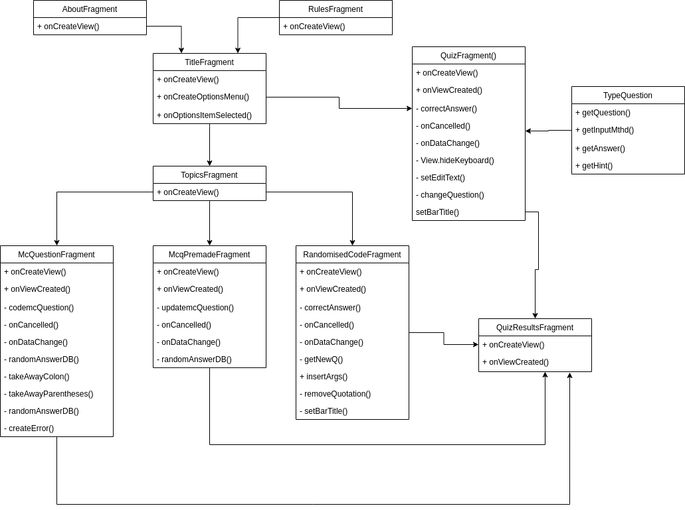
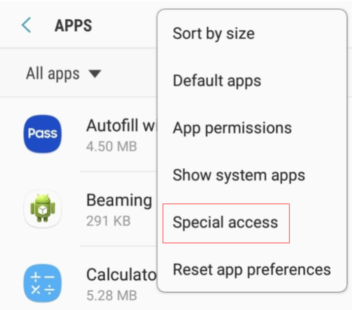
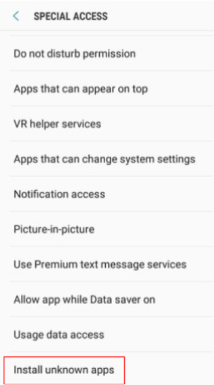
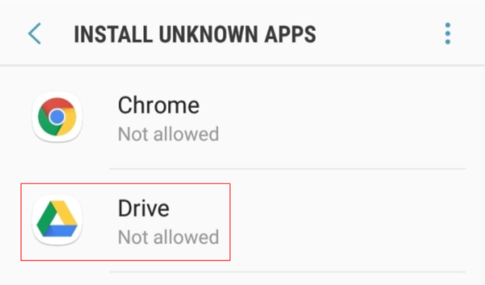
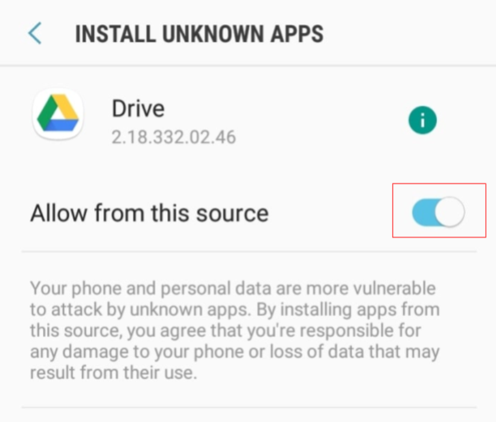
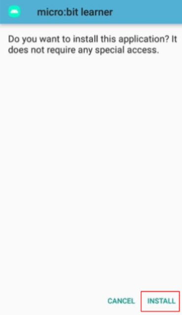

	<h1>CA326</h1> 
	<h1>James Farrelly</h1>
	<h1>Emily Whyte</h1> 
	<h1>micro:bit learner</h1> 
	<h1>Technical manual</h1>  

## Table of contents 
1. Introduction………………………… 
1.1 Overview………………………… 
1.2 Glossary………………………… 
1.3 Motivation………………………… 
2. System Architecture………………………… 
3. High-Level Design………………………… 
4. Problems and Resolution………………………… 
5. User testing………………………… 
6. Installation Guide………………………… 

## 1.1 Overview
Micro:bit learner is an Android application that is aimed towards students that are using BBC micro:bits to learn programming in school. The BBC micro:bit is a pocket sized computer which can be programmed in various languages and communicated with through micro USB connection or Bluetooth. The micro:bit has a variety of features which students can experiment with, including:
* 25 LED lights which can be used to display words, numbers and images
* 2 buttons
* Pins that can sense touch, add or power other electronics
* A radio and bluetooth antenna
* A compass
* An accelerometer 

Micro:bit learner gives students the opportunity to strengthen their understanding of the programming fundamentals that they will learn in school. The quizzes in this app cover variables, loops, if statements and error codes. These are all vital for students to know in order to successfully write their own programs and fulfill their imaginative ideas with the micro:bit. These programming concepts are also common obstacles faced by novice programmers. 
Micro:bit learner quizzes utilise a database to generate randomised code snippets for students to read and answer questions about. This encourages students to properly understand the code they are reading, not only remembering the one correct answer for a hard-coded question. Students get instant feedback on the correctness of the answers they choose while doing quizzes, as well as a total result at the end. 
Students can also use the code in the questions to write their own micro:bit programs to test the different outputs that may occur. 

### 1.2 Glossary
Term | Definition
--- | ---
BBC micro:bit | A handheld micro-computer which is programmable with many features.
Java | A general purpose, class-based and object-oriented programming language.
Python | A general purpose, interpreted, high-level programming language.
MicroPython | An implementation of Python 3 that is optimised for use on microcontrollers and constrained environments.
Kotlin | An open source, general purpose and statically typed programming language with type interface.
Android Studio | The official integrated development environment used for Google’s Android operating system.
GUI | A graphical user interface that allows a user to interact with an electronic device with the use of graphics and audio.
APK | An Android package file is used to distribute and install mobile apps, games and middleware.
Firebase | A development platform that belongs to Google. One product is a real-time database that can be used to store data from applications on the Firebase cloud.
Toast | A message that will pop up on the screen of an Android app for a short time.
JSON | JavaScript Object Notation uses text to store and transmit data objects.

### 1.3 Motivation
A large source of inspiration for this project was [Duolingo](https://www.duolingo.com/), the app for learning foreign languages. Duolingo uses activities and quizzes to teach users a language, while keeping it fun and simple. We hoped to make our app something that students would enjoy starting up so they can brush up on their programming skills and keep coming back to as the questions constantly change. 
[This article](https://www.creativebloq.com/web-design/beginner-programming-mistakes-1132856) points out the top mistakes made by beginner programmers. Included in this list is poorly formatted code and not reading errors. We hoped this app would help students become less likely to run into these mistakes. 
We looked at micro:bit programming [tutorials](https://microbit-challenges.readthedocs.io/en/latest/) to create questions and code snippets that would be understood by students.   
We decided to use  the [Kotlin](https://kotlinlang.org/) language to develop our app because it is more concise, safer and 100% interoperable with Java, according to [this article](https://www.udemy.com/blog/kotlin-vs-java-9-benefits-of-kotlin-for-your-business/). As stated [here](https://kotlinlang.org/docs/reference/comparison-to-java.html), Kotlin also fixes many issues faced by Java. Kotlin is Google's preferred language for Android app development. We believed it would be valuable for us to learn Kotlin to both challenge ourselves and gain a new language that is growing in popularity. 
Our decision to move our data to a database was also motivated by hoping to learn something new, which we did in setting up the reading of data for the app. The database also provides us with the ability to possibly implement various other languages in the future and to make it easier to insert new questions for the quizzes. 

## 2. System Architecture

	

 

### 2.1 Home screen GUI
The initial screen that the user is loaded in to. From here they can access the topics fragment or quit the application. 
### 2.2 Topics Fragment
From the topics fragment the user can choose from one of the 4 quiz formats. 
### 2.3 Typing Questions Quiz
Here the user uses the keyboard to input an answer to a quiz question before completing all quizzes and moving onto the results layout. 
### 2.4 Firebase Database
This is where the json file that holds the data for the quizzes is held. It is visited before moving to any of the other quizzes except the typing questions quiz fragment as it has hard-coded questions and answers. 
### 2.5 Multiple Choice Quiz
Here the user must select one of four options for a quiz. This will be repeated a number of times until the fragment has run out of questions. 
### 2.6 Code Snippet Quiz
Here the user must pick one of four options, with the questions being a randomly generated python snippet. This fragment has 3 different difficulties which the user selected in the topics fragment. Once the user completes the set amount of quizzes they move onto the results. 
### 2.7 Code Error Quiz
The user must choose one of 4 options. This quiz features python code snippets with some errors. 
### 2.8 Results Layout
Here the user can view how many questions they have gotten correct in the previous quiz. 

## 3. High-Level design
### Initial design
Students and other users of the micro:bit learner app will be able to choose between multiple programming languages that are used to write programs for micro:bits. Python and JavaScript will be implemented first. This language will be practiced through interacting with various activities in the app. Users will be able to choose from a list of different topics to cover in the activities they do. Selecting a topic will take users to an activity based on that topic. First-time users will be shown a tutorial on how to do each activity. 
The quizzes and user progress are stored in the device memory so the app can be used while offline. 
The first activity type is a quiz, with questions relating to the previously chosen topic. Some questions have one correct answer, while others have multiple. 
Another activity type is filling in the blanks in pieces of code to encourage users to mentally evaluate equations in programming.
Debugging activities require the user to re-type broken lines of code or identify problematic lines. Another debugging activity involves matching error codes with their plain language definitions. 
Feedback for activities will be present as users choose or enter answers throughout activities. Selecting a wrong answer will prompt an explanation for the correct answer to appear on-screen. At the end of each activity, users can review the questions they answered incorrectly. Results are broken down to highlight areas of concern.
Syntax definitions can be displayed for certain words if a user clicks on them. 
### Current design

	

Due to time constraints, the micro:bit learner app currently only supports learning Python without any JavaScript. Quizzes have been used but fill in the blanks questions are not implemented. This feature has been removed from the design as we underestimated the amount of time it would take to learn to use a new programming language, Kotlin and to try app development for the first time. 
We made the decision to store the questions for quizzes in a Firebase database, rather than in the user’s device storage directly. This means the app is no longer fully available while not connected to any internet. Using the database has given our questions more variety and the ability to challenge our users, as well as providing us with the new experience of connecting to a database from a mobile app. The data for the app is stored in a JSON file in the Firebase cloud. 
Debugging practice is still somewhat part of the design, but it is in the form of a different type of activity now. Errors are randomly placed into code snippets that have been retrieved from a Firebase database and the user must select which error code has been produced. We believe this will still help build an understanding of the errors young programmers will inevitably face. The typing question quiz that we have implemented has the potential to be configured into a re-typing errors activity in the future.
We have not implemented the highlighted syntax definitions feature in our current design but we have implemented hint buttons which can be used to provide definitions for certain syntax to help users. 
Users still get instant feedback when they answer any question. They also see the amount of questions they got right out of the amount of questions they were asked once an activity has ended. Time constraints have caused us to exclude the features of answer explanations and more specific result breakdowns. 

## 4. Problems and resolution
* We found that the questions in the quizzes would become repetitive and too easy to answer after doing the activities a few times. It was clear a user could do a quiz a couple times then no longer benefit from it. To solve this, we implemented the database with randomising questions and code to constantly provide the user with new, unique questions.
* Adding hard-coded questions took a long time as we had stored three different string values for each question (question, answer and hint) and then had to enter the strings into a question object. Using the database now means that we can easily add questions by updating the JSON file.
* Some quizzes would not show properly on smaller phone screens or when the code snippets were longer than usual. One user pointed this out in user testing. This was fixed by making the question pages scrollable to allow for more content on the screen without compromising on the size of text or buttons.
* Quizzes that retrieve data from the database would begin by displaying buttons with no text and question boxes containing placeholder text which is unappealing. One user pointed out that these quizzes appeared to start slowly. This was fixed by implementing an image that will cover the entire screen until the right data is loaded in and the user can begin answering questions.

## 5. User testing
We performed tests on users in order to get feedback as we thought this was a vital part of development and it ended up  being extremely helpful even though we did not get to implement every idea suggested due to lack of time. 
In order to do this we set up the application on our phones which we then handed to the participants and let them navigate themselves as well as answer questions without any input from us. We then did an anonymous survey where we got some useful feedback. 
Overall people really liked the navigation and found the app easy to explore rating it 4/5, although it was recommended that we add a back button on the results page in the center of the page as the corner is an awkward point to reach and to maintain a flow. Participants were impressed with the overall design, although one participant preferred the Duolingo topic selection system to ours and participants said they would use the app if they did coding. They did find that there was not much to tell them where they went wrong however, and while this was a feature we really wanted to implement we just ran out of time in the end.

## 6. Installation guide
Required:
* Android mobile phone with Android version 6.0 or higher
* Google Drive app

Steps may vary slightly depending on the phone you have.
1. Open the “Apps” section of your phone’s settings. 
2. Open the drop-down menu in the upper-right corner of the screen and select “Special access”. 

	

3. Find and click on “Install unknown apps”. 

	

4. Find and click on “Google Drive” in the list of apps. 

	

5. Click to “Allow from this source”. 

	

6. Download the microbitlearner.apk file in the Google Drive here: https://drive.google.com/drive/folders/1VetqhdCUafdnEalAOhn8cyskqwI1Am9Q?usp=sharing  

7. Choose “Install” when asked if you want to install this application. 

	

8. When the app is installed, click on “open” and you can begin using micro:bit learner. 

Internet connection is required to run the app.