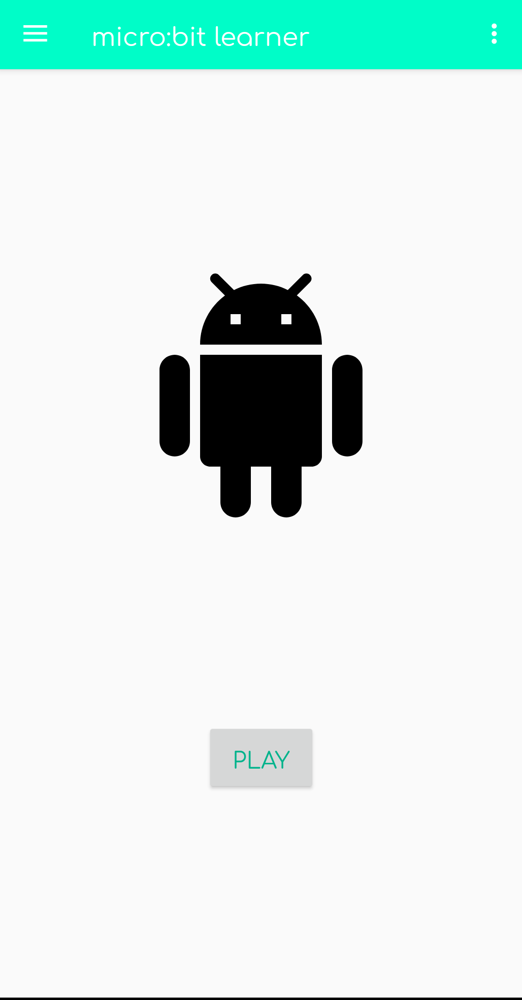

	<h1>CA326</h1> 
	<h1>James Farrelly</h1>
	<h1>Emily Whyte</h1> 
	<h1>micro:bit learner</h1> 
	<h1>User Manual</h1>   

<h2><u>Table of contents</u></h2> 
&nbsp;&nbsp;&nbsp;&nbsp;<b>1.</b>System Overview 
&nbsp;&nbsp;&nbsp;&nbsp;<b>2.</b>Installation Guide 
&nbsp;&nbsp;&nbsp;&nbsp;<b>3.</b>Home screen 
&nbsp;&nbsp;&nbsp;&nbsp;<b>4.</b>Topics screen 
&nbsp;&nbsp;&nbsp;&nbsp;<b>5.</b>Typing question quiz 
&nbsp;&nbsp;&nbsp;&nbsp;<b>6.</b>Multiple choice quiz 
&nbsp;&nbsp;&nbsp;&nbsp;<b>7.</b>Code snippet quiz 
&nbsp;&nbsp;&nbsp;&nbsp;<b>8.</b>Code error quiz 
&nbsp;&nbsp;&nbsp;&nbsp;<b>9.</b>Quiz Results   

<h2><u>1. System overview</u></h2> 
This is a user manual for the micro:bit learner, an Android mobile application created as part of a third year project. The aim of the app is to assist those who are learning to program in school. The system includes many different types of quizzes, some of which are automatically generated. Once a quiz has been completed, the user can see how many questions they have gotten correct.  

<h2><u>2. Installation guide</u></h2> 
To run the app you will need to have at least Android Studio 6.4 or higher installed on your PC or download the APK. 
From Android Studio to an emulator:  
&nbsp;&nbsp;&nbsp;&nbsp;1. Open the project in Android Studio. 
&nbsp;&nbsp;&nbsp;&nbsp;2. If you do not have an emulation device installed open the AVD manager in the top right corner of the program as shown in the image below.  
  

	

  
&nbsp;&nbsp;&nbsp;&nbsp;3. Click create virtual device, then choose the device you wish to emulate and the operating system version you wish to run it on, the minimum supported being Android 6. Android 10 would be optimal. If you wish to just get things up and running, keep everything as default and keep clicking next and finish.
  

	

  
&nbsp;&nbsp;&nbsp;&nbsp;4. Once installed just run the app through the AVD manager and the app will install and open itself on the emulator when ready.
  

	

  
<b>To run this app your Android phone must be running version 4.4 or higher.</b> 
<b>From Android Studio:</b> 
&nbsp;&nbsp;&nbsp;&nbsp;1. Open the project in Android Studio 
&nbsp;&nbsp;&nbsp;&nbsp;2. Enter settings on your phone and scroll to the bottom until the build number is visible. 
&nbsp;&nbsp;&nbsp;&nbsp;3. Tap the build number 5 times to enable developer options, then open system settings and navigate to developer options and enable USB debugging. 
&nbsp;&nbsp;&nbsp;&nbsp;4. Plug your phone into the PC using a usb and say yes when prompted with enabling the transfer of files on your phone. 
&nbsp;&nbsp;&nbsp;&nbsp;5. Press the “run selected configuration” button beside where your phone name has appeared like in the image for part 4 of the previous part.  
&nbsp;&nbsp;&nbsp;&nbsp;6. Allow the gradle build to run and let the app install your phone, the app should open once complete.  
<b>From APK (may differ slightly from phone to phone):</b> 
Android version 10.0 or over 
&nbsp;&nbsp;&nbsp;&nbsp;1. Download the APK from the Google Drive at this link: 
&nbsp;&nbsp;&nbsp;&nbsp;https://drive.google.com/open?id=1Z_rhGKV-izFnvQasUZ79CbKI8nEJwE6v  
&nbsp;&nbsp;&nbsp;&nbsp;2. Click the completed download or install a file explorer app and navigate to Downloads where it can be clicked. 
&nbsp;&nbsp;&nbsp;&nbsp;3. Grant the app the permission to download 
&nbsp;&nbsp;&nbsp;&nbsp;4. The app should safely install.   
Android version 6.0 or over 
&nbsp;&nbsp;&nbsp;&nbsp;1. Install Google Drive from the Google Play Store. 
&nbsp;&nbsp;&nbsp;&nbsp;2. Open your phone settings and navigate to the apps section. Once in the apps section, open the drop down menu in the upper right-hand corner and press “Special access”. 
&nbsp;&nbsp;&nbsp;&nbsp;3. Click “Install unknown apps” and find Google Drive in the list of apps shown. 
&nbsp;&nbsp;&nbsp;&nbsp;4. Click the button to “Allow from this source”.  
&nbsp;&nbsp;&nbsp;&nbsp;5. Download the APK from the Google Drive at this link:  
&nbsp;&nbsp;&nbsp;&nbsp;https://drive.google.com/open?id=1Z_rhGKV-izFnvQasUZ79CbKI8nEJwE6v  
&nbsp;&nbsp;&nbsp;&nbsp;6. Click the APK and then, when prompted, click install.  

<h2><u>3. Home Screen</u></h2> 
This is the first screen you are presented with. From here you can access the quiz topics by pressing the “play” button. You can also access the “rules” and “about” sections of the app by using the drop down menu in the top right hand corner of the screen or the navigation menu on the top left.   

	

  

<h2><u>4. Topics screen</u></h2> 
From this scrollable screen you can access the different quiz features of the app. To scroll simply hold your finger on the screen and swipe up or down. Simply press the desired quiz button and it will navigate you to it. The different quiz styles will be talked about below. Some of these quizzes vary in difficulty and the difficulty is stated as the quiz title. If you wish to return to the home screen simply tap the back arrow in the top left corner of the app or use the back button on your phone.   

	

  

<h2><u>5. Typing questions quiz</u></h2> 
On this screen you will be presented with a programming question. In order to answer you must tap the “Enter your answer” text. This will bring up a keyboard to which your answer can be entered. If you are struggling with the question and need help tap the “NEED A HINT?” button, which will then turn blue and turn into a hint for the current question. Once you are happy with your answer press the “SUBMIT” button. Text will then show up on the bottom of your screen telling you if you were correct or not and you will be directed to the next question if you are not already on the last. If you are on the final question you will be navigated to the results section of the app. This will be talked about later. The number in the top left keeps track of your current question and how many you have left. Like the topics screen the back arrow in the top left corner will bring you back to the previous page, for this it being the topics screen, this is the same for all the quizzes.  

	

  

<h2><u>6. Multiple choice quiz</u></h2> 
This quiz contains a number of pre-written code questions. The question gives you a code snippet and you must guess the output. Answer options are randomised, so they will likely never be the same but the answer will always be among them. The number counter at the centre of the screen lets you know what question you are on and how many you have left. The hint button will make a hint appear for a couple of seconds at the bottom of your screen. To choose your answer select the button/answer you chose (it will turn white when done so) and press the “SUBMIT” button. You will be notified if correct or incorrect in the same place the hint appeared. Once finished you will be navigated to the results page.  

	

  

<h2><u>7. Code snippet quiz</u></h2> 
Upon first opening this quiz you will be greeted with a loading screen, this will disappear once questions have loaded. There are easy, medium and hard versions of this quiz. These questions are similar to the multiple choice quiz. You are given a random code snippet which changes every time its asked and then asked to choose an answer to the question asked. Unlike the multiple choice quiz, you do not confirm your answer. Once an answer is selected you are notified if correct or incorrect and move on to the next question until the quiz is finished. Like the typing quiz, your current progress is displayed in the top left corner, with the quiz showing you how many questions you have completed and have left.  

	

  

<h2><u>8. Code error quiz </u></h2> 
The code error quiz gives you the option of easy or hard, with the easier option just being shorter code snippets. The objective of this quiz is to figure out what error code will be outputted by the program, or if one will be at all. Questions and answer options are random, although the answer is always present. The quiz works the same way as the multiple choice quiz, in that you select an answer/button and it turns white you do so. You then click confirm to move on to the next question if there is one. The hint button will also provide a clue when pressed.   

	

  

<h2><u>9. Quiz results</u></h2> 
Finally once a quiz is complete you will be brought to this page where you will be given your score out of how many questions you have completed correctly as well as receiving it in percentage form Along with this you will be given different encouragement based on how you did. To return to the topics screen simply press the back button in the top left corner.  

	

  
